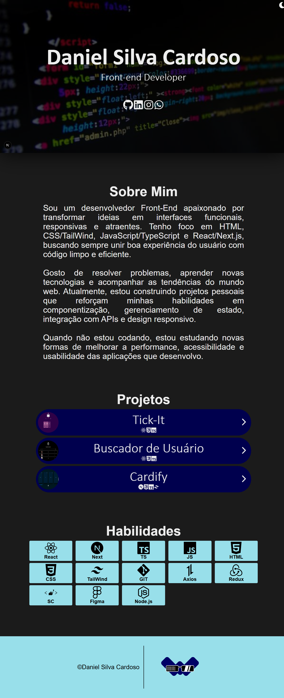
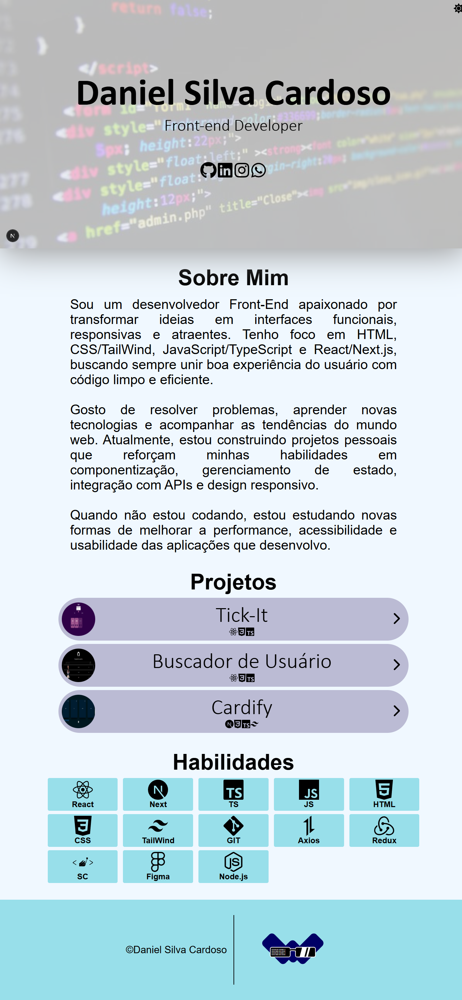

# Portifólio

[](https://nodejs.org/)  
[](https://vitejs.dev/)  
[](https://www.typescriptlang.org/)  
[](https://chatgpt.com/g/g-QNQZOPJ63-readme/c/LICENSE)

## RESUMO
Portfólio desenvolvido com o objetivo de apresentar minhas habilidades em criação e desenvolvimento de interfaces web, destacando minha capacidade técnica e criatividade na construção de sites funcionais e atraentes.

---

## ✨ Sessões

- `Home`
	
- `AboutMe`
	
- `Projects`
	
- `Skills`

---

## 🛠️ Tecnologias Utilizadas

- `Next.js`
	
- `CSS`
	
- `React-icons`
	
- `TypeScript`

---

## ▶️ Como Rodar o Projeto

### 🔧 Pré-requisitos

- [Node.js](https://nodejs.org/) v16+
    
- [npm](https://www.npmjs.com/) ou [yarn](https://yarnpkg.com/)
    

### 🚀 Passos

```bash
# Clonar o repositório
git clone https://github.com/Daniel13s/portifolio13s.git
cd portifolio

# Instalar dependências
npm install
# ou
yarn install

# Rodar aplicação
npm run dev
# ou
yarn dev
```

Após iniciar, acesse no navegador:

```
http://localhost:5173
```

---
## 📷Preview
**Layout-Dark**
<div style="display-flex; flex-direction: column;"></div>

**Layout-Light**
<div style="display: flex; flex-direction: column;"></div>